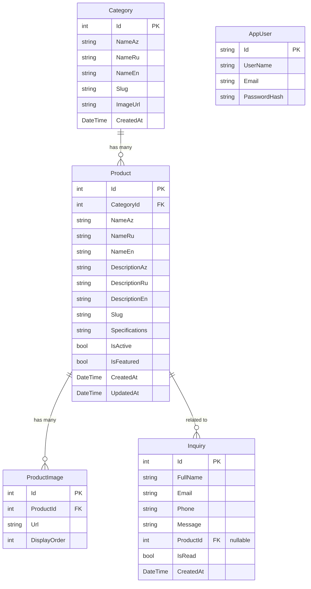
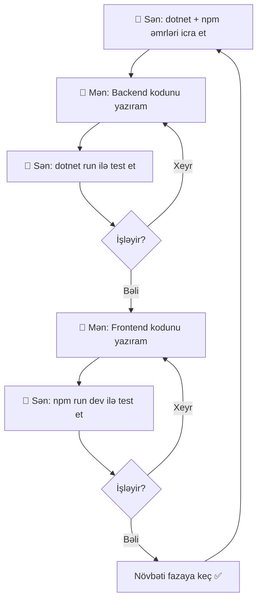

# 🏭 BakuPlastTech — Korporativ Veb Sayt Roadmap (v2)

## 📋 Layihə Xülasəsi

| Xüsusiyyət | Dəyər |
|---|---|
| **Şirkət** | BakuPlastTech |
| **Sahə** | Plastik inşaat materialları (klips, taxoz, elektrik qutuları, probka və s.) |
| **Sayt tipi** | Korporativ / Katalog saytı |
| **Dillər** | 🇦🇿 Azərbaycan, 🇷🇺 Rus, 🇬🇧 İngilis |
| **E-ticaret** | ❌ Yoxdur (qiymət yoxdur, alış-veriş yoxdur) |
| **Admin panel** | ✅ Bəli (məhsul, kateqoriya, müraciət idarəsi) |

---

## 🛠️ Texnologiya Steki

### Backend — C# .NET
| Texnologiya | Məqsəd |
|---|---|
| **ASP.NET Core 8 Web API** | RESTful API |
| **Entity Framework Core** | ORM — verilənlər bazası əməliyyatları |
| **SQL Server (LocalDB)** | Verilənlər bazası (production-da real SQL Server) |
| **ASP.NET Core Identity** | Admin autentifikasiya (JWT token) |
| **AutoMapper** | DTO ↔ Entity mapping |
| **FluentValidation** | Request validasiya |

### Frontend — React
| Texnologiya | Məqsəd |
|---|---|
| **React 18+ (Vite)** | SPA frontend |
| **React Router v6** | Səhifə routing |
| **i18next + react-i18next** | Çoxdilli dəstək (AZ, RU, EN) |
| **Axios** | API sorğuları |
| **Vanilla CSS + CSS Modules** | Stil idarəsi |
| **Lucide React** | İkonlar |
| **React Hot Toast** | Bildirişlər |
| **React Hook Form** | Form idarəsi |

---

## 📐 Layihə Arxitekturası

```
BakuPlasttech/
├── backend/          ← C# ASP.NET Core Web API
└── frontend/         ← React (Vite) SPA
```

### Backend Qovluq Strukturu

```
backend/
├── BakuPlastTech.API/
│   ├── Controllers/
│   │   ├── AuthController.cs          # Login/Register
│   │   ├── CategoriesController.cs    # Kateqoriya CRUD
│   │   ├── ProductsController.cs      # Məhsul CRUD
│   │   ├── InquiriesController.cs     # Müraciət idarəsi
│   │   └── UploadController.cs        # Şəkil yükləmə
│   ├── Data/
│   │   ├── AppDbContext.cs            # EF Core DbContext
│   │   └── DbSeeder.cs               # İlkin data seed
│   ├── Models/
│   │   ├── Category.cs
│   │   ├── Product.cs
│   │   ├── ProductImage.cs
│   │   ├── Inquiry.cs
│   │   └── AppUser.cs
│   ├── DTOs/
│   │   ├── CategoryDto.cs
│   │   ├── ProductDto.cs
│   │   ├── InquiryDto.cs
│   │   └── AuthDto.cs
│   ├── Services/
│   │   ├── ICategoryService.cs / CategoryService.cs
│   │   ├── IProductService.cs / ProductService.cs
│   │   ├── IInquiryService.cs / InquiryService.cs
│   │   └── IFileService.cs / FileService.cs
│   ├── Mapping/
│   │   └── MappingProfile.cs          # AutoMapper profili
│   ├── Middleware/
│   │   └── ExceptionMiddleware.cs     # Global error handling
│   ├── Program.cs                     # App konfiqurasiya
│   ├── appsettings.json
│   └── BakuPlastTech.API.csproj
```

### Frontend Qovluq Strukturu

```
frontend/
├── public/
│   └── locales/                # Tərcümə faylları
│       ├── az/translation.json
│       ├── ru/translation.json
│       └── en/translation.json
├── src/
│   ├── api/
│   │   ├── axiosInstance.js    # Axios konfiqurasiya (baseURL, interceptors)
│   │   ├── categoryApi.js     # Kateqoriya API çağırışları
│   │   ├── productApi.js      # Məhsul API çağırışları
│   │   ├── inquiryApi.js      # Müraciət API çağırışları
│   │   └── authApi.js         # Auth API çağırışları
│   ├── components/
│   │   ├── public/            # İstifadəçi saytı
│   │   │   ├── Header/
│   │   │   ├── Footer/
│   │   │   ├── Hero/
│   │   │   ├── ProductCard/
│   │   │   ├── LanguageSwitcher/
│   │   │   └── ContactForm/
│   │   ├── admin/             # Admin panel
│   │   │   ├── Sidebar/
│   │   │   ├── AdminHeader/
│   │   │   ├── DataTable/
│   │   │   ├── ProductForm/
│   │   │   ├── CategoryForm/
│   │   │   └── StatsCard/
│   │   └── ui/                # Ümumi UI
│   │       ├── Button/
│   │       ├── Input/
│   │       ├── Modal/
│   │       ├── Card/
│   │       └── Loader/
│   ├── pages/
│   │   ├── public/
│   │   │   ├── HomePage.jsx
│   │   │   ├── AboutPage.jsx
│   │   │   ├── ProductsPage.jsx
│   │   │   ├── ProductDetailPage.jsx
│   │   │   └── ContactPage.jsx
│   │   └── admin/
│   │       ├── LoginPage.jsx
│   │       ├── DashboardPage.jsx
│   │       ├── ProductsAdminPage.jsx
│   │       ├── CategoriesAdminPage.jsx
│   │       └── InquiriesAdminPage.jsx
│   ├── layouts/
│   │   ├── PublicLayout.jsx    # Header + Footer wrapper
│   │   └── AdminLayout.jsx    # Sidebar + Header wrapper
│   ├── context/
│   │   └── AuthContext.jsx    # JWT token idarəsi
│   ├── hooks/
│   │   ├── useAuth.js
│   │   └── useFetch.js
│   ├── styles/
│   │   ├── globals.css        # Design system (rənglər, şriftlər)
│   │   ├── variables.css      # CSS custom properties
│   │   └── animations.css     # Animasiyalar
│   ├── utils/
│   │   └── helpers.js
│   ├── i18n.js                # i18next konfiqurasiya
│   ├── router.jsx             # React Router konfiqurasiya
│   ├── App.jsx
│   └── main.jsx
├── index.html
├── vite.config.js
└── package.json
```

---

## 📊 Verilənlər Bazası Modeli (EF Core)



---

## 🔌 API Endpointləri

### 🔓 Public (Autentifikasiya tələb olunmur)

| Method | Endpoint | Təsvir |
|---|---|---|
| `GET` | `/api/categories` | Bütün kateqoriyalar |
| `GET` | `/api/categories/{slug}` | Tək kateqoriya + məhsulları |
| `GET` | `/api/products` | Məhsul siyahısı (filtr + axtarış + pagination) |
| `GET` | `/api/products/featured` | Populyar məhsullar |
| `GET` | `/api/products/{slug}` | Məhsul detalı |
| `POST` | `/api/inquiries` | Müraciət göndər |

### 🔒 Admin (JWT tələb olunur)

| Method | Endpoint | Təsvir |
|---|---|---|
| `POST` | `/api/auth/login` | Admin giriş → JWT token |
| `GET` | `/api/admin/dashboard` | Statistika |
| `POST` | `/api/categories` | Kateqoriya əlavə et |
| `PUT` | `/api/categories/{id}` | Kateqoriya redaktə et |
| `DELETE` | `/api/categories/{id}` | Kateqoriya sil |
| `POST` | `/api/products` | Məhsul əlavə et |
| `PUT` | `/api/products/{id}` | Məhsul redaktə et |
| `DELETE` | `/api/products/{id}` | Məhsul sil |
| `GET` | `/api/inquiries` | Müraciət siyahısı |
| `PUT` | `/api/inquiries/{id}/read` | Oxunmuş kimi işarələ |
| `DELETE` | `/api/inquiries/{id}` | Müraciət sil |
| `POST` | `/api/upload` | Şəkil yüklə |

---

## 🌐 Sayt Səhifələri

### İstifadəçi Saytı

```
/ (Ana səhifə)
├── Hero bölməsi — şirkət sloganı, CTA düymələri
├── Haqqımızda qısa — şirkətin təqdimatı
├── Populyar məhsullar — seçilmiş məhsullar kartları
├── Niyə biz? — üstünlüklər (keyfiyyət, sertifikat)
└── Əlaqə bloku — qısa əlaqə forması

/about (Haqqımızda)
├── Şirkət tarixi
├── Missiya və vizyonumuz
├── İstehsal prosesi
└── Sertifikatlar

/products (Məhsullar)
├── Kateqoriya filtrləmə (sidebar / tabs)
├── Axtarış
├── Məhsul kartları (şəkil + ad + qısa təsvir)
└── Pagination

/products/:slug (Məhsul Detalı)
├── Şəkil qalereyası
├── Məhsul adı və təsviri
├── Texniki xüsusiyyətlər cədvəli
└── "Sorğu göndər" düyməsi

/contact (Əlaqə)
├── Əlaqə forması
├── Google Maps embed
├── Ünvan, telefon, email
└── Sosial şəbəkə linkləri
```

### Admin Panel

```
/admin/login         → Giriş
/admin/dashboard     → Statistika
/admin/products      → Məhsul CRUD
/admin/categories    → Kateqoriya CRUD  
/admin/inquiries     → Müraciətlər
```

---

## 🗺️ İnkişaf Fazaları

### ⬜ Faza 1 — Layihə Quraşdırması
> Backend + Frontend layihələrini yaratmaq, əsas konfiqurasiyalar

**Sən edəcəksən (paket/əmrlər):**
```powershell
# Backend
cd C:\Users\Ravan999\Desktop\BakuPlasttech
mkdir backend
cd backend
dotnet new webapi -n BakuPlastTech.API --no-https
cd BakuPlastTech.API
dotnet add package Microsoft.EntityFrameworkCore.SqlServer
dotnet add package Microsoft.EntityFrameworkCore.Tools
dotnet add package Microsoft.EntityFrameworkCore.Design
dotnet add package Microsoft.AspNetCore.Authentication.JwtBearer
dotnet add package AutoMapper.Extensions.Microsoft.DependencyInjection
dotnet add package FluentValidation.AspNetCore
dotnet add package BCrypt.Net-Next

# Frontend
cd C:\Users\Ravan999\Desktop\BakuPlasttech
npm create vite@latest frontend -- --template react
cd frontend
npm install
npm install react-router-dom axios i18next react-i18next i18next-http-backend i18next-browser-languagedetector lucide-react react-hot-toast react-hook-form
```

**Mən edəcəyəm (kod):**
- [ ] EF Core modellər + DbContext
- [ ] JWT auth konfiqurasiya (Program.cs)
- [ ] CORS konfiqurasiya
- [ ] Axios instance + interceptorlar
- [ ] i18n konfiqurasiya 
- [ ] React Router setup
- [ ] CSS Design System
- [ ] Qovluq strukturunu yaratmaq

---

### ⬜ Faza 2 — Backend API (tam)
> Bütün API endpointlər + service layer

**Mən edəcəyəm:**
- [ ] AuthController (login, JWT generation)
- [ ] CategoriesController (CRUD)
- [ ] ProductsController (CRUD + filter + search + pagination)
- [ ] InquiriesController (CRUD)
- [ ] UploadController (şəkil yükləmə)
- [ ] Services + Interfaces
- [ ] DTOs + AutoMapper profili
- [ ] Validasiyalar (FluentValidation)
- [ ] Global Exception Middleware
- [ ] DbSeeder (admin istifadəçi + test data)

---

### ⬜ Faza 3 — Admin Panel (React)
> Admin paneli frontend

**Mən edəcəyəm:**
- [ ] Admin Layout (sidebar + header)
- [ ] Login səhifəsi + AuthContext
- [ ] Protected routes (JWT yoxlama)
- [ ] Dashboard (statistika kartları)
- [ ] Kateqoriya idarəsi (siyahı, əlavə, redaktə, sil)
- [ ] Məhsul idarəsi (siyahı, əlavə, redaktə, sil + şəkil yükləmə)
- [ ] Müraciət idarəsi (siyahı, oxu, sil)

---

### ⬜ Faza 4 — İstifadəçi Saytı (React)
> Public frontend — gözəl dizayn

**Mən edəcəyəm:**
- [ ] Header + Footer + Dil dəyişdirici
- [ ] Ana səhifə (Hero, populyar məhsullar, niyə biz, əlaqə)
- [ ] Haqqımızda səhifəsi
- [ ] Məhsullar səhifəsi (kateqoriya filtr + axtarış + pagination)
- [ ] Məhsul detal səhifəsi (qalereya + xüsusiyyətlər)
- [ ] Əlaqə səhifəsi (forma + xəritə)
- [ ] Responsive dizayn
- [ ] Animasiyalar + micro-interactions

---

### ⬜ Faza 5 — Cilalamaq
> Son dizayn düzəlişləri, SEO, error handling

**Mən edəcəyəm:**
- [ ] SEO meta tags
- [ ] Loading / Skeleton ekranları
- [ ] 404 / Error səhifələri
- [ ] Scroll animasiyalar
- [ ] Son testlər

---

## 🎨 Dizayn Konsepti

| Element | Dəyər |
|---|---|
| **Əsas rəng** | `#0052CC` (Korporativ mavi) |
| **Aksent rəng** | `#FF6B2C` (Turuncu — CTA üçün) |
| **Arxa fon** | `#F7F9FC` (Açıq) |
| **Kart fonu** | `#FFFFFF` |
| **Mətn** | `#0F1B2D` (Başlıq), `#4A5568` (Əsas) |
| **Şrift** | Inter (Google Fonts) |
| **Border radius** | 12px (kartlar), 8px (düymələr) |
| **Kölgə** | Soft shadows, glassmorphism effektləri |
| **Animasiya** | Framer Motion tərzi CSS keçidlər |

---

## 🔄 İş Axını



---

> [!IMPORTANT]
> **Başlamaq üçün ilk addım — Faza 1 əmrlərini icra et!**
> Yuxarıdakı `dotnet` və `npm` əmrlərini terminalda çalışdır, sonra mənə "hazırdır" yaz.
